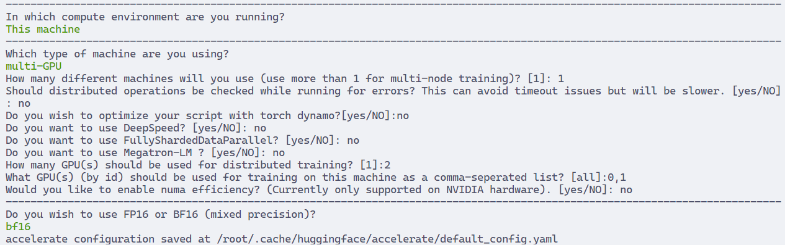

# Finetune and align LLM models

## LLM Efficient Fine-tuning
- QLoRA
- DDP

## LLM Alignment
- RLHF
- DPO


## Notes
- Train on 1 GPU
```bash
CUDA_VISIBLE_DEVICES=0 torchrun --nproc_per_node=1 --nnodes=1 train_sft_lora.py
```

- Config train DDP with accelerate
```bash
export CUDA_VISIBLE_DEVICES=0,1
# set config like image bellow
accelerate config 
# run train ddp with accelerate
accelerate launch train_sft_lora.py --run_name "sft_lora_gemma_multigpu" --device_map all
```


## Results
- Train SFT (not eval): ~ 30GB GPU
- Train with QLoRA: ~15GB GPU
- Train DDP: 2 GPU


## TODO
- [ ] Evaluate SFT model and LoRA model
- [ ] Public HF models
- [ ] Train FSDP (problem with accelerate)
